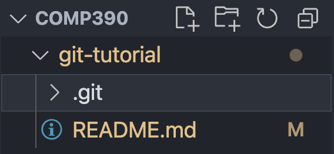
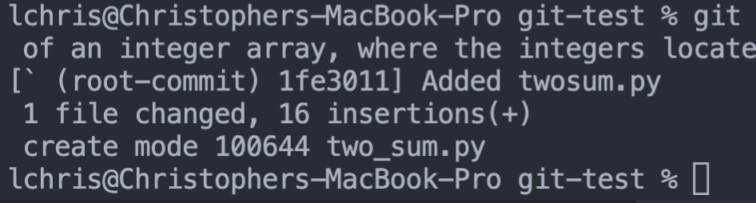
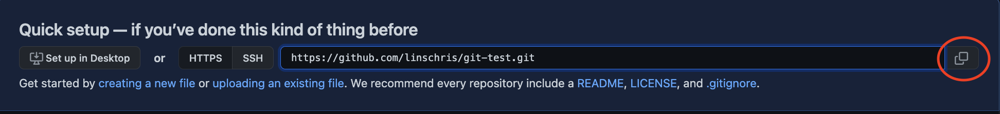
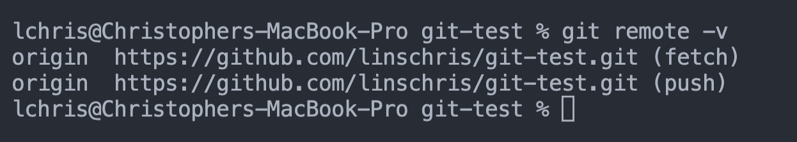
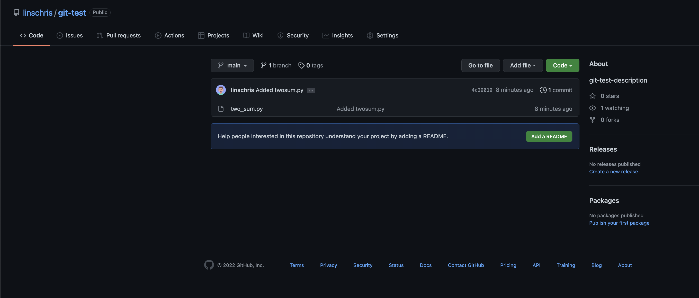

<h1 align="center"> Git Tutorial </h1>
<h3 align="center"> Created by Christopher Linscott </h3>
<p align="center"> A guide to setting up and using a Git repository in correspondence with Github.<p>

## Table Of Contents:

1. [Introduction](#introduction)
    * [What is a Git Repository?](#what-is-a-git-repository)
    * [Git's "Assembly Line"](#gits-assembly-line)
2. [Getting Started](#getting-started)
    * [Setting Up The Git Repository](#setting-up-the-git-repository)
    * [Working Up The Tree](#working-up-the-tree)
    * [The Staging Area](#the-staging-area)
    * [The Local Repository](#the-local-repository)
    * [Creating the Online Github Repository](#creating-the-online-github-repository)
    * [Linking Local Repository With Github Repository](#linking-local-repository-with-github-repository)
    * [Pushing Code To GitHub](#now-lets-push-our-code)
3. Branching
4. Topic 4
5. References


# Introduction

Before we get started, having a bit of knowledge of what a Git repository is and the "assembly line" of the 4 possible areas where you code could currently be (from Git's perspective) can be quite helpful before you start this tutorial.

## What is a Git repository?

A Git repository is simply a folder that contains the *changes* you make to your project, whether you __add, change, delete, or rename__ a file. 

Note that the folder stores the *history* of changes you made as well, by what it known as a __commit graph__ (i.e. a list of nodes containing what changes you made with the HEAD node being the most recent changes.)

> "Deleting your [.git] folder is deleting your project's history..." *- GitKraken*

It's stored in the same project folder, alongside any other files. 
You won't see it since it's stored as a hidden folder, but if you're curious:



## Git's "Assembly Line"

### The way I think about it is, your code can be in one of 4 stages:

* __Working Tree__
    * Your home base: files that have been added, changed, etc, but that aren't ready to be added to the codebase just yet.
        * Maybe a feature you're still fixing a bug on, or a file you don't want to be seen by the public.
* __Staging Area__
    * Control center: add what you *want* to commit (i.e. not change at the moment anymore), keep what you don't in the working tree.
        * 
* __Local Repository__
    * Local storage: all the code currently on your computer you're ready to publish, whether or not it matches with the online repository.
* __Remote Github Repository__
    * Your "production", where the code is now open to the world or whatever team you're working on.

### Code will flow from the working tree to the remote github repository.

# Getting Started
### To begin, there are mainly 2 ways to initalize or start a Git repository.

1. (__*Recommended*__) Creating a Github repository on your Github account, and cloning it onto your local machine. 
2. Initalizing a Git repository on your local machine, creating a Github repository, and setting the origin (or where you push the code) to be the Github repository's URL.
    * Given, this is a Git __Command Line__ Tutorial, my tutorial will cover this way.

## Setting Up The Git Repository

First, find and/or create a folder you want to call this project's home. 

I will be creating a folder inside of my COMP 390 folder named: `git-test`.

Next, go into your terminal and navigate to this folder by grabbing the path and typing in the following path: 

`cd {path_name}`

    cd /Users/lchris/Desktop/Coding/schoolprojects/comp390/git-test
> Note: If you have VSCode and you open VSCode with the folder you create, the terminal will be adjusted to the folder's location.

Great! Now, simply type in the following command:

    git init

This should return:

    Initialized empty Git repository in /Users/lchris/Desktop/Coding/schoolprojects/comp390/git-test/.git/

and will initalize the Git repository inside of the folder, which can be seen as shown [above](#what-is-a-git-repository) and/or if you have [your hidden files](https://medium.com/pareture/show-git-and-other-default-hidden-folders-and-files-in-vs-code-57df151588ea) showing.

Next, add any small files such as 
* hi.txt, index.html, main.py 

and add content inside of them to get your project started and confirm that the later steps in this tutorial work properly.

Here's some free code to copy (and I'll be making a random file __two_sum.py__ to populate my git repo).

```python
/COMP390/git-test/two_sum.py

def two_sum(arr, target):
    sum_dict = {} # Returns index of number
    for index, num in enumerate(arr):
        curr_complement = target - num
        if curr_complement in sum_dict:
            complement_index = sum_dict[curr_complement]
            return [complement_index, index]
        sum_dict[num] = index
    return [-1, -1] # Not found
```

## Working Up The Tree

Great, you should now have a repository with a folder containing some files with content inside of them.

Now, our code is currently in stage 1, in the __working tree__.

To say to Git 'our code is ready to be set in stone (Github's history that is)',
we do the following:

```git add .``` OR ```git add {file}```

Ex: ```git add two_sum.py```

With these commands, our code has now been moved from __Working Tree__ &#8594; __Staging Area__.
 
## The Staging Area

So, your code is in the staging area now. You have two options:
- If you __like__ your code and you want to make it set in history (as a commit) on your local machine, *commit* it.
    - To commit, do the following command:
        - ```git commit -m "{title_of_commit}" -m "{description_of_commit}"```
        - > NOTE: the title is only required, omit the second -m to exclude a description.

        - Ex: ```git commit -m "Added twosum.py" -m "Added a file which can compute the indices of an integer array, where the integers located at this indices adds up to a target value."```

- If you __don't like__ how it is so far, you can *restore* it from the staging area by the following command.
    -   ```git restore --staged```

To continue onwards, please commit whatever files you've currently added.

Upon commiting, you should see a similar response:



By commiting, our code has now been moved from the __Staging Area__ &#8594; __Local Repository__.


## The Local Repository

We're almost there! 

It's set in stone (or history) on *our local machine*, but not on Github, or where it could be accessed, pulled, or downloaded by someone else.

Now, we need to set up a repository on Github for use. Navigate to [Github](github.com) and create an account if you don't already have one.

For the next step, remember your username or navigate to your user profile.

## Creating the Online Github Repository

Now, navigate to the your user profile via the link `github.com/{your-username}`
or anywhere on Github.

### To create a GitHub repository, do the following:
1) Go to the '+' button on the top right hand corner
2) Click on 'New repository'
3) Now, the name nor description of the repository matter: make them what you please.
    > NOTE: only the GitHub Repository name is required, so if anything make a name.
    * I will using "git-test" and "git-test-description" for my name and description.
4) __Don't ADD anything__ 
    * Adding a README.md, .gitignore, or any other file beforehand will add commits to this online repository, leading to __unrelated histories__ (i.e. you can't merge/push your current code to this new repository)
5) Click __Create repository__
6) You should be redirected to a new page at `github.com/{username}/{git-repo-name}`
    * This page should be a quick set-up guide, providing some steps to pushing code to the Git repo.
7) Copy the link to the Github repository's Git Repository by clicking the icon shown below in the quick set-up guide.



<h3 align="center">Here's a quick GIF showcasing everything:</h3>


Great! All is left is to link the online Github repository with your current local repository on your computer.

## Linking Local Repository With Github Repository

To link our local repository with the current online Github repository we just created, do the following commands:

    git remote add origin {copied_git_link}
    git branch -M main

Upon doing so, if you type in `git remote -v`, you should get:



## Now, let's push our code!

To finally push our code from our local repository to the Github repository, do the following command:

    git push -u origin main

### Upon reloading the quick setup page we were just at, the page should now contain the files you added:



Congrats! We've now created our own GitHub repository!


> Note: The commands shown below will make more sense, given the knowledge of [Git's 4 data stores](#gits-assembly-line).

# Branching

### Suppose you had a friend working on the same project `git-test` as you, but he's still working on implementing a new feature `three_sum.py`.

```python

    def three_sum(arr, target):
        left = 0
        right = 0
        # Not sure how to solve just yet..

```

He still wants to save his progress, but he doesn't want to push his code and ruin any code you've curated.

While yes he could just save everything on his local machine, what if he wants to work on this feature from a different computer somewhere else?

This is the (or my inital) idea behind branching...

## Commit Graph


## Switching To A New Branch

To create and move into a new branch, type in the following command:

    git checkout -b {new_branch_name}
> NOTE: if the branch is already made, simply omit the -b to only move into the branch.

Ex: `git checkout -b three_sum`

    Switched to a new branch 'three_sum'

### Now, we're in a new branch! Note that the adding and committing are all the same.

Using the knowledge from [before](#working-up-the-tree), make changes to the file two_sum.py:

```python
def three_sum(arr, target):
    left = 0
    right = 0
    arr.sort()
    # Not sure what to do just yet...
```


# Merging/Rebasing


# References
Special thanks to these videos/articles
for contributing the knowledge to make this project possible:
* [GitKraken](https://www.gitkraken.com/learn/git/tutorials/what-is-a-git-repository)