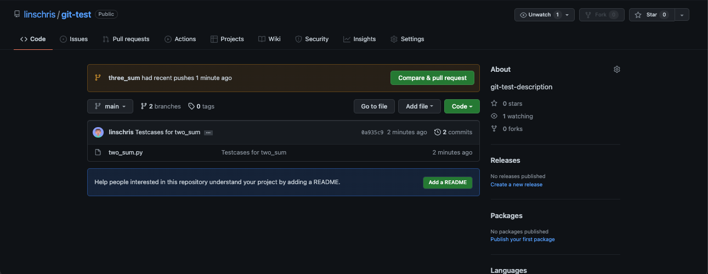

<h1 align="center"> Git Tutorial </h1>
<h3 align="center"> Created by Christopher Linscott </h3>
<p align="center"> A guide to setting up and using a Git repository in correspondence with Github.<p>

## Table Of Contents:

1. [Introduction](#introduction)
    * [What is a Git Repository?](#what-is-a-git-repository)
    * [Git's "Assembly Line"](#gits-assembly-line)
    * [Commit Graph](#commit-graph-1)
2. [Getting Started](#getting-started)
    * [Setting Up The Git Repository](#setting-up-the-git-repository)
    * [Working Up The Tree](#working-up-the-tree)
    * [The Staging Area](#the-staging-area)
    * [The Local Repository](#the-local-repository)
    * [Creating the Online Github Repository](#creating-the-online-github-repository)
    * [Linking Local Repository With Github Repository](#linking-local-repository-with-github-repository)
    * [Pushing Code To GitHub](#now-lets-push-our-code)
    * [Stashing For Later](#stashing-for-later)
3. [Branching](#branching)
    * [Switching To A New Branch](#switching-to-a-new-branch)
4. [Merging](#merging)
    * [Fixing Merge Conflicts](#fixing-merge-conflicts)
5. [References](#references)


# Introduction

Before we get started, having a bit of knowledge of what a Git repository is, and the 4 possible areas where you code could be (from Git's perspective) can be quite helpful before you start this tutorial.

## What is a Git repository?

A Git repository is simply a folder that contains the *changes* you make to your project, whether you __add, change, delete, or rename__ a file. 

Note that the folder stores the *history* of changes you made as well, by what it known as a __commit graph__ (i.e. a list of nodes containing what changes you made with the HEAD node being the most recent changes.)

> "Deleting your [.git] folder is deleting your project's history..." *- GitKraken*

It's stored in the same project folder, alongside any other files. 
You won't see it since it's stored as a hidden folder, but if you're curious:


## Git's "Assembly Line"

### The way I think about it is, your code can be in one of 4 stages:

* __Working Tree__
    * Your home base: files or changes on your computer that have been modified or added, but that have not been logged/tracked by Git yet.
        * Maybe a feature you're still fixing a bug on, or a new file you're adding to the project.
* __Staging Area__
    * Control center: the staging area holds what you *want* to commit (or want to log/save in your project's history), while keeping what you don't want saved in the working tree.
* __Local Repository__
    * Local storage: all the code currently on your computer that has been committed or logged by Git within the project's .git folder, whether or not it matches with the online repository.
* __Remote Github Repository__
    * Remote storage: files on a different computer, where it's open to those who can see your Github Repository, instead of being only on your current computer.
    * Great for collaboration or for saving your progress (without the worry of losing your local .repository's git folder).

### Code will flow from the working tree to the remote GitHub repository.

## Commit Graph

While not neccessary for this tutorial, but a great way of understanding commits and branches is through what is known as the *commit graph*.

Your project's history can be thought of as a long chain of commits or "snapshots" of your code as it changes over time, or in a more sophicated way, it can be thought of as a directed acyclic graph of commits(DAG).

Here's a quick example of a simple commit-graph:


Read left to right.
Each letter can thought of as a node, which each node being a commit we make to a branch within repository.

In this example, we can see that we have a "main" history going from A->B->C->D (such as the production history with updates A,B,C,D). But, on the side, we see E -> F -> G as a "side" history or branch, which contains a history about the feature begin implemented over time after the "B" update. 

* Each of these commits will be represented in Git by a 40-character hexadecimal string!
    * Called "hashes", are signatures establishing "The changes I made before this commit are correct" in terms of who made them, when they were made, and what changes were made.
    * Each commit can have multiple children, where each new "break-off" child (E) is a new [branch](#branching) (don't worry if you don't know branches yet).

To get a vertical, pretty version of this graph, use:

    git log

> NOTE: This shows the commits in the current working branch.
> Other methods such as `git rev-list --remotes` will show all the commit hashes, but not in
> a pretty way.

# Getting Started

## Before we begin, you should have:
* A computer
* Some sort of text editor (VSCode, Atom, etc.)
* Some knowledge of the terminal and filesystem (How to open it, move around directories...)

### To begin, there are mainly 2 ways to initalize or start a Git repository.

1. (__*Recommended*__) Creating a Github repository on your Github account, and cloning it onto your local machine using `git clone {url}`. Afterward, you can add/commit files as usual.
2. Initalizing a Git repository on your local machine, creating a Github repository, adding files, and setting the origin (or where you push the code) to be the Github repository's URL.
    * Given, this is a Git __Command Line__ Tutorial, my tutorial will cover this way.
    * This method is better if you're already started progress on your project in your local machine.

## Setting Up The Git Repository

First, find and/or create a folder you want to call this project's home. 

I will be creating a folder inside of my COMP 390 folder named: `git-test`.

Next, go into your terminal and navigate to this folder by grabbing the path and typing in the following path: 

`cd {path_name}`

    cd /Users/lchris/Desktop/Coding/schoolprojects/comp390/git-test
> Note: If you have VSCode and you open VSCode with the folder you create, the terminal will be adjusted to the folder's location.

Great! Now, simply type in the following command:

    git init

This should return:

    Initialized empty Git repository in /Users/lchris/Desktop/Coding/schoolprojects/comp390/git-test/.git/

and will initalize the Git repository inside of the folder, which can be seen as shown [above](#what-is-a-git-repository) and/or if you have [your hidden files](https://medium.com/pareture/show-git-and-other-default-hidden-folders-and-files-in-vs-code-57df151588ea) showing.

Next, add/create any files that pertain to your project inside the folder.

For this tutorial/project, we're going to make a file containing solutions to questions on [Leetcode](https://leetcode.com).

To begin with, we'll be making a file called `two_sum.py` which can be a help with solving the problem [2Sum](https://leetcode.com/problems/two-sum/).

Here's some free code to copy for this file __two_sum.py__.

```python
/COMP390/git-test/two_sum.py

def two_sum(arr, target):
    sum_dict = {} # Returns index of number
    for index, num in enumerate(arr):
        curr_complement = target - num
        if curr_complement in sum_dict:
            complement_index = sum_dict[curr_complement]
            return [complement_index, index]
        sum_dict[num] = index
    return [-1, -1] # Not found
```

## Working Up The Tree

Great, you should now have a repository with a folder containing at least one file with content inside of it.

Now, our code is currently in stage 1, in the __working tree__.

To say to Git 'our code is ready to be set in stone (Github's history that is) or staged',
we do the following:

```git add .``` OR ```git add {file}```

Ex: ```git add two_sum.py```

With these commands, our file has now been moved from __Working Tree__ &#8594; __Staging Area__

## The Staging Area

So, your code is in the staging area now. You have two options:
- If you __like__ your code and you want to make it set in history (as a commit) on your local machine, *commit* it.
    - To commit, do the following command:
        - ```git commit -m "{title_of_commit}" -m "{description_of_commit}"```
        - > NOTE: the title is only required, omit the second -m to exclude a description.

        - Ex: ```git commit -m "Added twosum.py" -m "Added a file which can compute the indices of an integer array, where the integers located at this indices adds up to a target value."```

- If you __don't like__ how it is so far, you can *restore* it from the staging area by the following command.
    - ```git restore --staged```

To continue onwards, please commit whatever files you've currently added.

Upon commiting, you should see a similar response:


By commiting, our code has now been moved from the __Staging Area__ &#8594; __Local Repository__.

## The Local Repository

We're almost there! 

It's set in stone (or history) on *our local machine* for our local Git repository, but not on Github, or where it could be accessed, pulled, or downloaded by someone else.

Now, we need to set up a repository on Github for use. Navigate to [Github](github.com) and create an account if you don't already have one.

## Creating the Online Github Repository

### To create a GitHub repository, do the following:
1) Go to the '+' button on the top right hand corner
2) Click on 'New repository'
3) Now, the name nor description of the repository matter: make them what you please.
    > NOTE: only the GitHub Repository name is required, so if anything make a name.
    * I will using "git-test" and "git-test-description" for my name and description.
4) __Don't ADD anything__ 
    * Adding a README.md, .gitignore, or any other file beforehand will add commits to this online repository, leading to __unrelated histories__ (i.e. you can't merge/push your current code to this new repository)
5) Click __Create repository__
6) You should be redirected to a new page at `github.com/{username}/{git-repo-name}`
    * This page should be a quick set-up guide, providing some steps to pushing code to the Git repo.
7) Copy the link to the Github repository's Git Repository by clicking the icon shown below in the quick set-up guide.


<h3 align="center">Here's a quick GIF showcasing everything:</h3>


Great! All is left is to link the online Github repository with your current local repository on your computer.

## Linking Local Repository With Github Repository

To link our local repository with the current online Github repository we just created, do the following commands:

    git remote add origin {copied_git_link}
    git branch -M main

The first command links our .git and project folder with the remote repository's git and project folder.

The second command creates a branch called main (don't worry about this yet).

Upon doing so, if you type in `git remote -v`, you should get:


## Now, let's push our code!

To finally push our code from our local repository to the Github repository, do the following command:

    git push -u origin main

> NOTE: This is only for the first time around, afterward you can omit the `-u`.

### Upon reloading the quick setup page we were just at, the page should now contain the files you added:


Congrats! We've now created and linked our own GitHub repository!

## Stashing For Later

In reference to the [Working Tree](#working-up-the-tree), what if you're not be ready to stage your code just yet? A great scenario [Git](https://git-scm.com/docs/git-stash) portrays is:
> "...[Say] you are in the middle of something, your boss comes in and demands that you fix something immediately..."

Instead of having to commit to store your progress away: we have __git stash__.

## Let's simulate this:

Make a new file `bfs.py` and begin doing some "work" on it...

```python
COMP390/git-test/bfs.py

def bfs(root):
    queue = []
    while len(queue) > 0:
        pass
    
```

### Uh oh... boss wants you to add testcases for the new two_sum function.
It's just as simple as:

    git stash -u

> NOTE: the '-u' is to signify untracked/new files (since we've created a new file).
> For modifications to files only, you can omit the -u.

### You should see the file disappear.


Let's do what our boss asked by going back to *two_sum.py* and adding:
```python

def main():
    print(two_sum([3,5,9,0,-1,-5], 4)) # Returns [1, 4]
    print(two_sum([], 0)) # Returns [-1,-1]

if __name__ == "__main__":
    main()

```

### Using the commands for committing and pushing to do our emergency fix:

    git add .
    git commit -m "Testcases for two_sum.py" -m "Added new testcases to test the two_sum function to make sure it works properly."
    git push origin main

### Now, after we do our emergency work, we can simply:

    git stash pop

### You should see your file 'bfs.py' reappear with the same changes we made! 


### You can continue to work on bfs.py and commit/push as necessary.

## We've done it! Here's a little visual of what we've learned so far:


# Branching

### Suppose you had a friend working on the same project `git-test` as you, but he's still working on implementing a new solution to 3Sum in the same file.

```python
    def three_sum(arr, target):
        left = 0
        right = 0
        # Not sure how to solve just yet..

```

They still wants to save their progress, but they doesn't want to commit his code and ruin any code that you've curated until they feel it's ready to be displayed.

Branching serves to act as a way to seperate code and files from each other when necessary, acting as almost like a "seperate timeline".

This stops your project's code from becoming a mess of different work-in-progress features, and instead promotes clean, independent "lines of development" that may or may not merge.

## Switching To A New Branch

To create and move into a new branch, type in the following command:

    git checkout -b {new_branch_name}
> NOTE: if the branch is already made, simply omit the -b to only move into the branch.

Ex: `git checkout -b three_sum`

    Switched to a new branch 'three_sum'

> NOTE: there are other commands such as git branch {new_branch_name}, but this command requires you to move to the branch using checkout or switch anyways. So, use the above command as a shortcut.

### Now, we're in a new branch! Note that the adding and committing are all the same.

Using the knowledge from [before](#working-up-the-tree), make changes to the file two_sum.py and afterward add, commit, and push these changes to the new three_sum branch:

```python
/COMP390/git-test/two_sum.py

def three_sum(arr, target):
    left = 0
    right = 0
    arr.sort()
    # Not sure what to do just yet...
```

    git add .
    git commit -m "Starting point for three_sum" -m "Issues with implementation."
    git push origin three_sum -- NOTE: the branch name is changed here to signify a different branch.

> NOTE: git push {remote_name} {branch_name}, so  push to three_sum instead of main, by changing the last line. To push to a different repository, you would change the {remote_name} from origin.

### Upon doing so, you should notice if you reload your GitHub repository...


> Don't worry about the "Compare & Pull Request" button just yet...

### Our new code has been put onto a different branch as well! To access this branch:
1. Select the branch dropdown and select the *three-sum* branch.
 

You should see your new changes to this branch! 

Before we move unto merging and rebasing:

Let's add a commit to two-sum to simulate two different "branches" or workflows currently going on.

Using your new-learned knowledge, switch back to the main branch via the command `git checkout main`, make any commit to two_sum.py, and push this commit to the main branch on Github.

I'll be adding these lines below our original two_sum.py in main (feel free to copy):

```python
def run_tests():
    # two_sum.py test cases
    run_test([2,3,5,7,8,12], 15, [3,4])
    run_test([], 0, [-1,-1])
    run_test([-1,-1], -2, [0,1])
    run_test([1], 1, [-1,-1])
    run_test([3,100,2,4,5,9], 110, [-1,-1])

def run_test(arr, target, correct_ans):
    test_answer = two_sum(arr, target)
    if test_answer != correct_ans:
        print(f"Two sum function given array {arr}, target {target} returned {test_answer}, but expected {correct_ans}")
    else:
        print(f"Two sum function given array {arr}, target {target} was correct, returned {test_answer}.")

def main():
    run_tests()

if __name__ == "__main__":
    main()
```
    git add .
    git commit -m "Modified 2Sum.py" -m "Added testcases to determine it works for edge and normal cases."
    git push origin main


I'll be just finishing three_sum() in the three_sum branch (make sure to do `git checkout three_sum`):
```python

def three_sum(arr, target):
    arr.sort()
    ans = []
    for i in range(len(arr) - 2):
        if i > 0 and arr[i] == arr[i-1]:
            continue
        left = i + 1
        right = len(arr) - 1
        curr_target = target - arr[i]
        while left < right:
            if arr[left] == arr[left + 1]:
                left += 1
            elif arr[right] == arr[right - 1]:
                right -= 1
            curr_sum = arr[left] + arr[right]

            if curr_sum < curr_target:
                left += 1
            elif curr_sum > curr_target:
                right -= 1
            else:
                ans += [arr[i], arr[left], arr[right]]
                left += 1
    return ans

def main():
    print(three_sum([3,3,3,5,7,8,12], 15)) # Prints [3,5,7]
```

    git add .
    git commit -m "Finished 3Sum Function" -m "Added functionality and removal of duplicates."
    git push origin three_sum


# Merging

## Current Commit Graph

### Each branch has a HEAD node, which is the current commit you're working tree is in.
- The last commit you've made.  

### So, for some context with our new knowledge of commit graphs, our current project looks like:


# Merging/Rebasing

## Let's get started with merging our two branches: `main` and `three_sum`.

To merge them together, switch to the main branch and execute:

    git checkout main  (if not in main branch)
    git merge three_sum

## You should notice something interesting pop up...

    lchris@Christophers-MacBook-Pro git-test % git merge three_sum
    Auto-merging two_sum.py
    CONFLICT (content): Merge conflict in two_sum.py
    Automatic merge failed; fix conflicts and then commit the result.

## Fixing Merge Conflicts!

### There are two options:
* __*(Recommended)*__ If you have an editor/GUI like Atom, Visual Studio Code, Github Desktop, or Gitkraken, you can simply go into the file and make the changes you want by selecting any of the options shown here:

    * For this tutorial, we can simply choose this option and go with '__Accept Both Changes__'.
    * Most editors should be able to do this, as Git shows the differences at which lines.

> NOTE: After accepting both changes, we can clean up and simply combine the two main methods yourself, by putting the print statement `print(three_sum([3,3,3,5,7,8,12], 15)) # Prints [3,5,7]` below the `run_tests()` function. You don't have to, but it can make the merged code nicer.

* If you don't have one of these editors, you can use Vim or a command line editor to view the changes, just note it's much more tricky.

## After resolving the conflict, it's at simple as committing and pushing.

    git add .
    git commit -m "Merged main and three_sum" -m "New feature: 3sum, allows the user to find three numbers in the array which add up to the target."
    git push origin main

## Your GitHub Repository Should Now Look Like...

    TODO

# And... That's It!
## You should have all the knowledge necessary to create your own Git project and get started.
* Feel free to go to back to the table of contents if you need a specific piece of knowledge!

# References
Special thanks to these videos, articles, and people
for contributing the knowledge to make this project possible:
* [GitKraken](https://www.gitkraken.com/learn/git/tutorials/what-is-a-git-repository)
* [Atlassian: Merging-Vs-Rebasing](https://www.atlassian.com/git/tutorials/merging-vs-rebasing)
* [Medium: Rebase vs Merge](https://medium.datadriveninvestor.com/git-rebase-vs-merge-cc5199edd77c)
* [Git: Stashing](https://git-scm.com/docs/git-stash)
* [Justin Li](https://github.com/justinnhli)